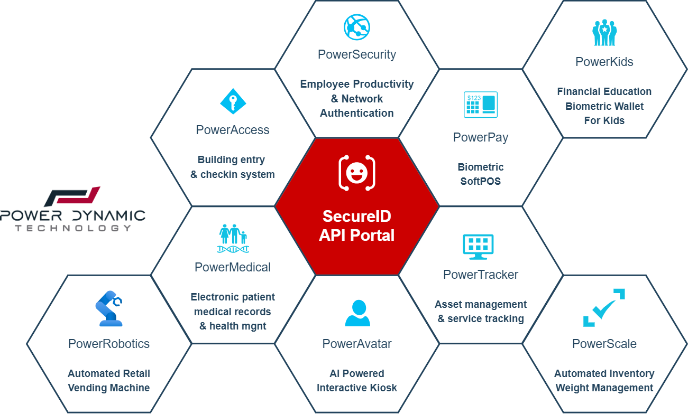
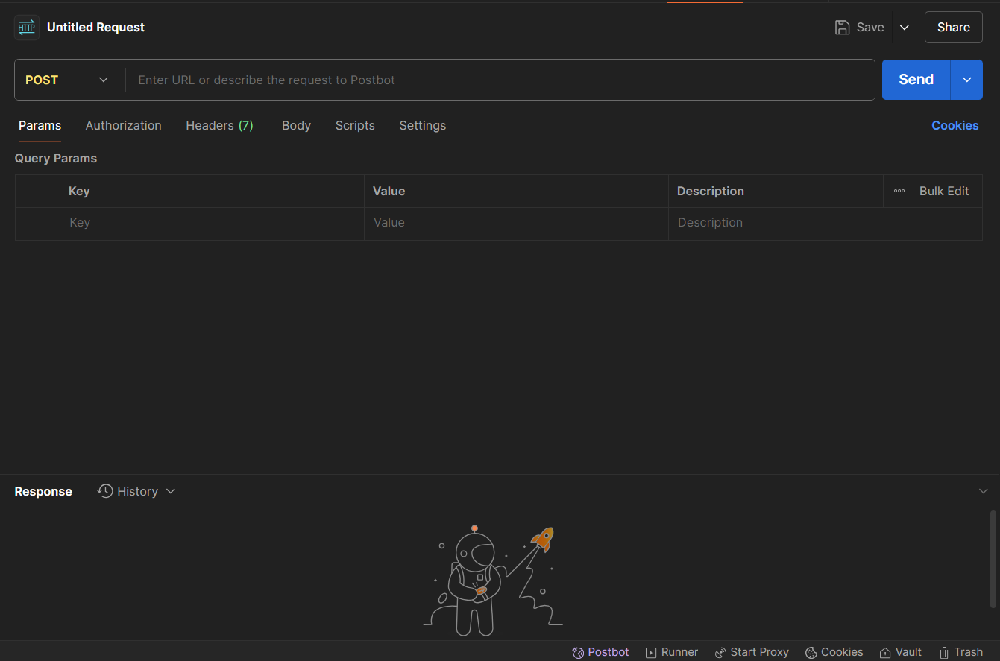
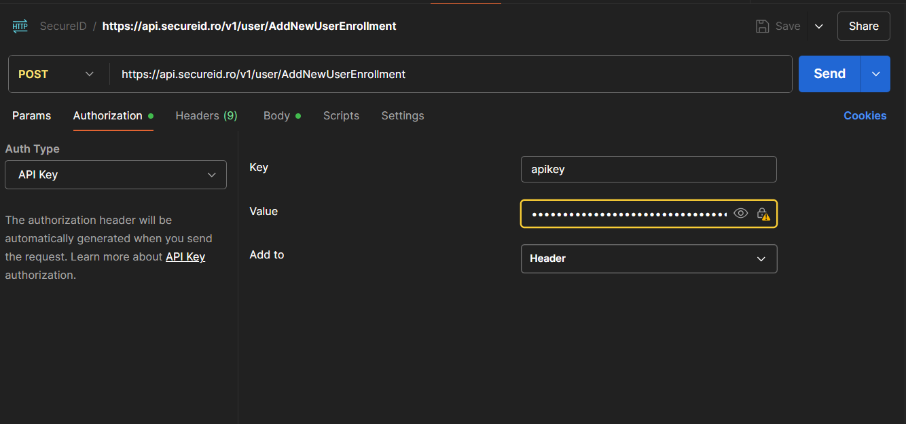
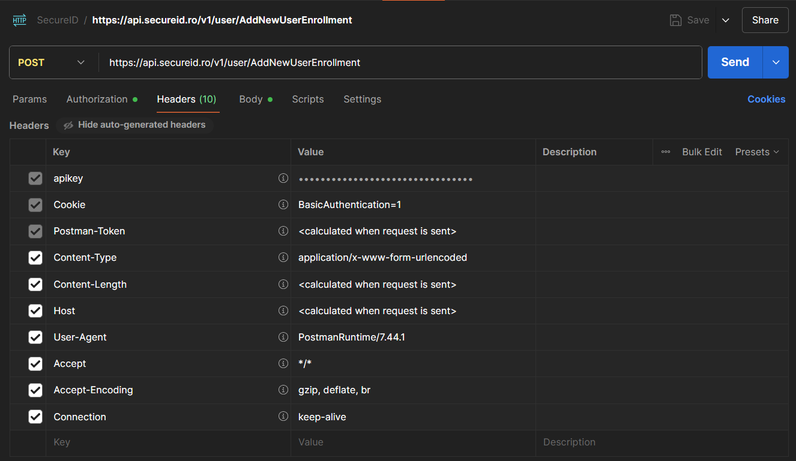
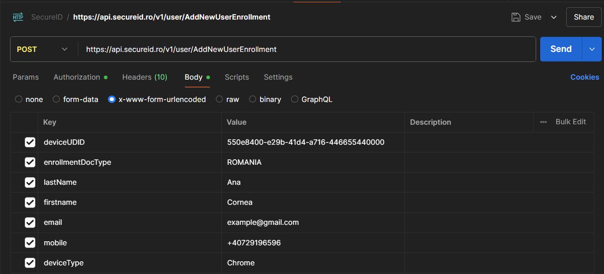
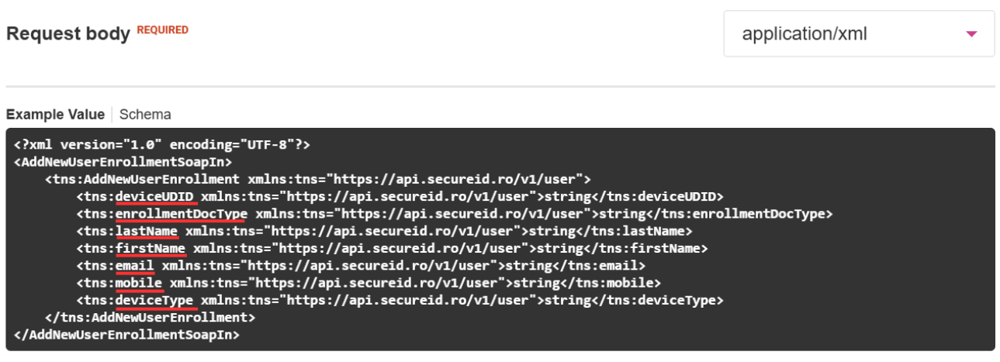
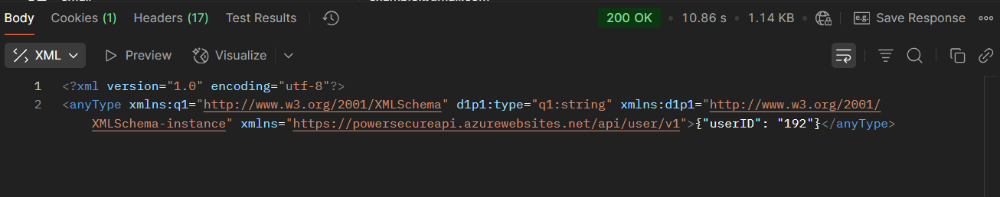
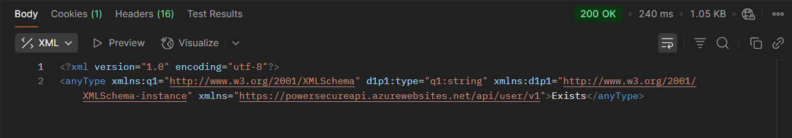

# Biometric Hackathon Challenge 2025 - Plătește cu fața

Event Link Facebook: https://fb.me/e/6sGBZoZrb  
Event Link LinkedIn: https://www.linkedin.com/events/biometrichackathonchallenge7342808445084962819/  
Event Link Meetup: https://www.meetup.com/power-dynamic-technology-demo-days/events/308604924/  

Organizat de Power Dynamic Technology  
Locație: Str Leordeni Nr 13, Bragadiru  

(Jul 12, 2025, 10:00 AM - Jul 13, 2025, 2:00 PM)  

## Tema  
Folosește-ți fața pentru a plăti, oriunde!  

[Dă click aici pentru a vedea prezentarea oficială a companiei !](readme-files/EUID%20Digital%20Wallet%20Overview.pdf)

## Descriere  
Poate ai observat deja, dar recunoașterea facială e peste tot. De la telefoane și aeroporturi, până la aplicații de securitate și plăți. Noi vrem să ducem tehnologia asta cu un pas mai departe și îți oferim ocazia să fii parte din următorul val de inovație. La hackathonul organizat de [Power Dynamic Technology](https://power-dynamic.ro/) ai la dispoziție [SecureID](https://secureid.ro), o platformă complet funcțională, cu tot ce-ți trebuie ca să nu pierzi timp cu setările de bază și să te concentrezi direct pe idee. Tu vii cu inovația, iar noi îți dăm API-urile, documentația, și exemplele de pornire. Scopul? Să creezi o aplicație unde îți poți folosi fața ca să plătești, oriunde. Într-un festival, la cafenea, în autobuz, la automat sau în aplicația ta de zi cu zi. Ai 24 de ore, o  
echipă și o idee. Restul e doar cod și imaginație.



Ca să-ți fie mai ușor să pornești, ți-am pregătit și o imagine cu ecosistemul SecureID - platforma pe care o vei folosi. Gândește-te la ea ca la un motor central în jurul căruia se pot construi tot felul de aplicații. Poți merge în direcții de acces biometric în clădiri, portofele digitale pentru copii, automate de vânzare smart, soluții medicale sau chioșcuri interactive AI. Toate au în comun același lucru: recunoașterea facială. Imaginea de mai jos îți arată exact în ce zone poți să inovezi sau poți veni cu o idee complet nouă, care să lege mai multe dintre ele sau să le folosească altfel.

## Integrarea cu SecureID

Pentru dezvoltare, vei avea acces complet la platforma noastra: https://dev.secureid.ro

Infrastructura existentă acoperă deja o gamă largă de funcționalități esențiale: adăugarea unui nou utilizator, înregistrarea copiilor, salvarea token-ului de plată, actualizarea locației prin GPS, setarea sau modificarea codului PIN, înregistrarea imaginilor pentru autentificare facială, verificarea identității pe baza feței, validarea codurilor de înregistrare sau invitație, verificarea statusului contului, autentificare biometrică, precum și gestionarea cardurilor implicite sau partajate.

### Cum accesezi și folosești SecureID ?

Pentru a începe dezvoltarea, urmează pașii de mai jos pentru a-ți crea un cont și a obține acces la API-ul SecureID:

1. Creează-ți un cont pe platformă: https://dev.secureid.ro/register  
2. După înregistrare, în secțiunea Product, selectează **SecureID Accounts API Beta**.  
3. Odată accesată pagina **SecureID Accounts API Beta**, vei vedea toate request-urile disponibile, acestea reprezintă funcționalitățile puse la dispoziție prin API.  
4. Apasă pe **Register for V1** pentru a-ți crea o aplicație nouă.  
5. După înregistrare, solicită acces prin butonul **Request Access**. Această aprobare va fi procesată de echipa organizatoare.  
6. După aprobare, apasă pe **Generate Credentials** pentru a obține cheia de autentificare (**API key**).  
   > **Atenție:** Cheia va fi afișată o singură dată, salveaz-o imediat!  
7. Autentificarea se face prin această cheie. Dacă o pierzi, poți genera una nouă în orice moment.

Pentru a facilita procesul de dezvoltare, ai la dispoziție și un exemplu complet în GitHub care îți arată cum să te autentifici ca utilizator folosind HTML, CSS și JavaScript, ca să poți începe rapid și fără bariere tehnice.

## Testare prin Postman  

### Ce este Postman?  
Postman este un instrument gratuit și foarte popular care te ajută să testezi API-uri, adică să trimiți cereri către un server și să vezi răspunsurile acestuia într-un mod organizat și vizual.  
Este util pentru a te familiariza cu formatul cererilor și cu structura răspunsurilor fără a scrie cod din prima.  
Poți folosi Postman pentru a testa cererile către SecureID și pentru a înțelege cum funcționează comunicarea cu serverul.

### Exemplu: AddNewUserEnrollment (POST)  
Îți poți instala Postman de aici: https://www.postman.com/downloads/  
Creează-ți un cont și deschide aplicația.  
Apasă pe “New Request” pentru a începe.

Se va deschide o pagină nouă pentru configurarea cererii:


- În colțul din stânga sus, setează metoda cererii pe **POST**.  
  (Fiecare endpoint din SecureID indică metoda sa: POST/GET etc.)

- În tab-ul **Authorization**:  
  - Selectează tipul: **API Key**  
  - **Key**: `apikey`  
  - **Value**: cheia ta generată în SecureID  
  - **Add to**: Header  


Acesta este modul prin care te autentifici la server.

- În tab-ul **Headers**:  
  Dacă ai configurat Authorization și Body corect, nu e nevoie să adaugi nimic manual.




- În tab-ul **Body**:  
  - Selectează opțiunea **x-www-form-urlencoded**  
  - Adaugă câmpurile necesare




### Cum afli ce câmpuri sunt necesare?  
În documentația **SecureID Accounts API Beta**, fiecare endpoint conține un tab **Example Value**.  
Deși este în format XML, poți vedea clar ce câmpuri sunt așteptate de server pentru fiecare cerere.


### Răspunsul din partea serverului va fi:
- **UserID**, dacă utilizatorul nu are cont:  


- **“Exists”**, dacă un cont cu acel email există deja:  



## TIPS  
- Pentru a evita erorile de tip CORS, trebuie să folosești un server proxy local.
  Codul sursă pentru acest server este disponibil în GitHub, fișierul `proxy.js`.  
  [Ce este CORS?](https://developer.mozilla.org/en-US/docs/Web/HTTP/Guides/CORS/Errors) [Ce este un server proxy local?](https://developer.mozilla.org/en-US/docs/Glossary/Proxy_server)

- Pentru a rula serverul proxy local ai nevoie de: **Node.js** și **npm** instalate  
  Poți să pornești serverul folosind comanda:  
  ```bash
  node proxy.js

- Cererile către server sunt transmise în format `key=value`, așa cum vei vedea în exemplele din Postman și în codul demonstrativ.

- Serverul prelucrează cererile în format XML, iar răspunsurile primite vor fi tot în format XML. Asigură-te că aplicația ta poate citi și procesa corect răspunsurile.

- Cod demonstrativ

  În folderul `demoCode` vei găsi un exemplu simplu de cod care ilustrează pașii de bază pentru crearea și autentificarea unui utilizator. Acest exemplu folosește următoarele patru endpoint-uri esențiale:
    - `AddNewUserEnrollment` - pentru înregistrarea unui utilizator nou  
    - `VerifyUserEmailWithEmail` - pentru verificarea adresei de e-mail  
    - `CheckRegistrationCode` - pentru confirmarea codului primit  
    - `AuthenticateUser` - pentru autentificarea finală

  Codul este conceput ca punct de plecare, oferind o bază clară și funcțională de la care poți porni dezvoltarea propriei aplicații.

## Reguli și criterii de jurizare
- **Urban Mobility**:  Relevanța pentru nevoile urbane locale - Cât de eficient răspunde soluția voastră provocărilor reale de identitate digitală în orașele moderne(ex: autentificare rapidă în transportul public, acces securizat la servicii locale, integrare cu infrastructura digitală urbană)?

- **Innovation**: Inovație tehnologică și originalitate - În ce măsură proiectul aduce o idee nouă sau valorifică recunoașterea facială într-un mod neexplorat până acum?

- **Integration**:  Capacitatea de integrare cu alte sisteme - Cât de bine poate fi integrată aplicația cu servicii, platforme sau infrastructuri deja existente (ex: POS-uri, carduri de transport, sisteme de acces)?

- **Business Model**: Viabilitate și impact comunitar - Este ideea sustenabilă pe termen lung? Poate funcționa ca un produs real? Ce impact ar avea asupra comunității, companiilor sau instituțiilor?


